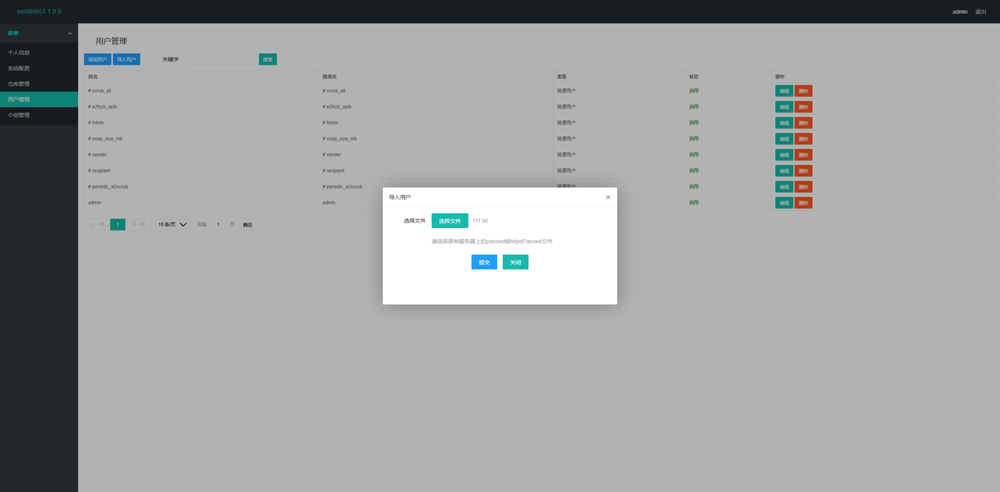
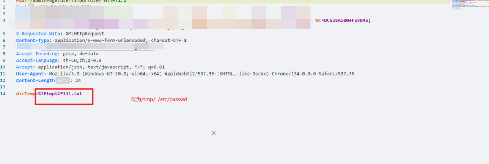
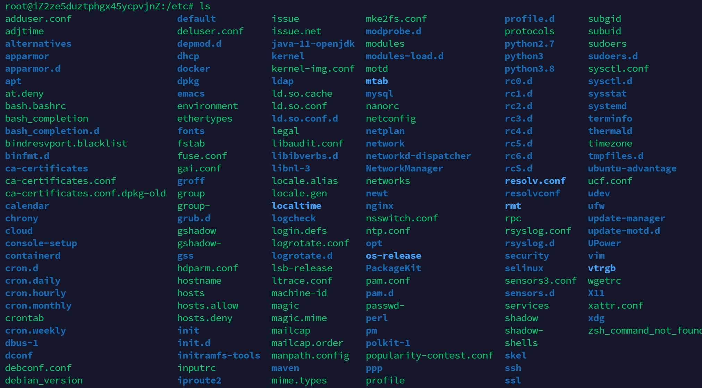
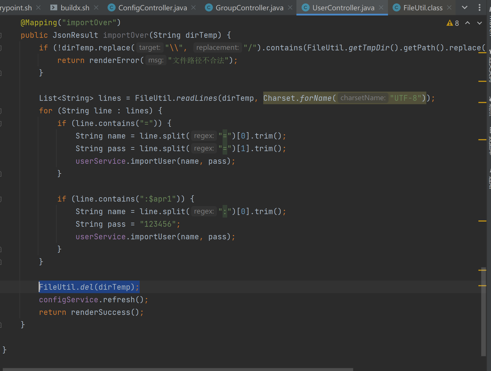
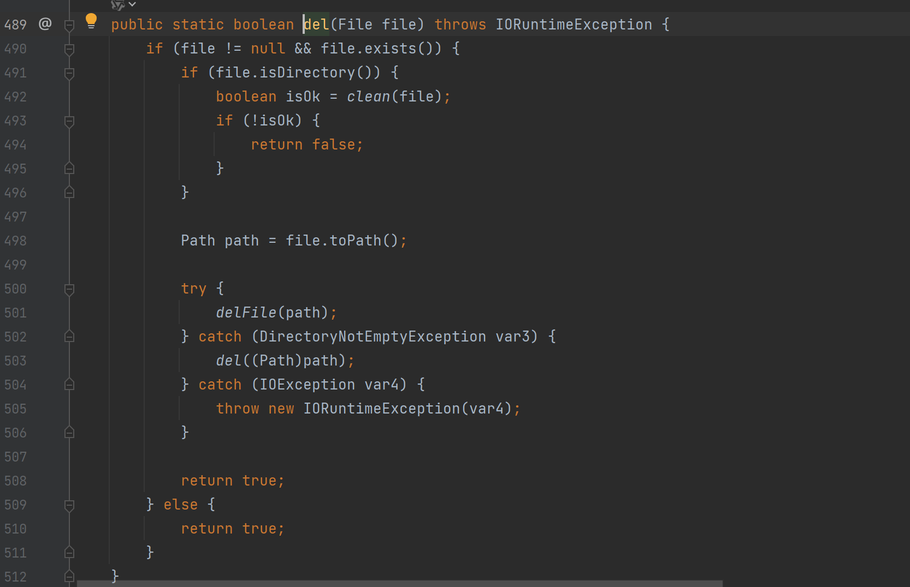
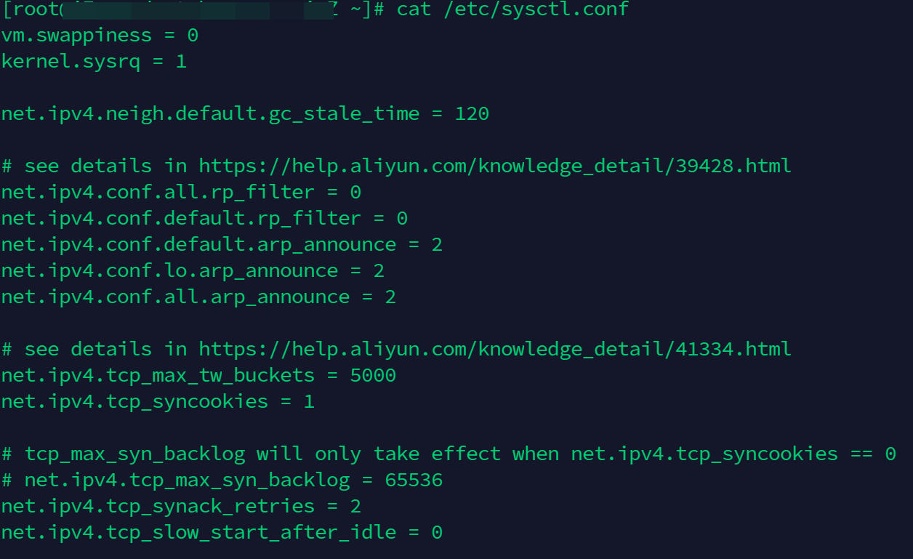
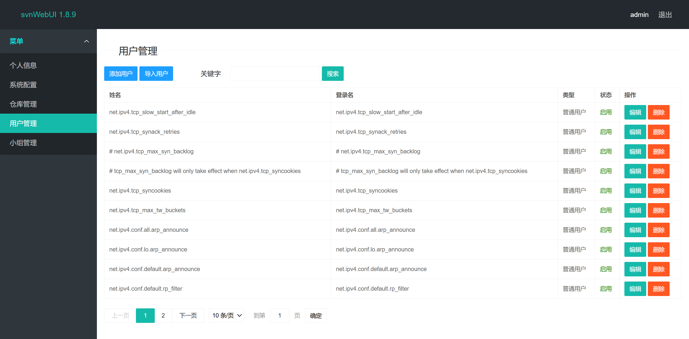

用户管理-导入用户处存在任意文件删除/读取

## 删除部分

导入用户，随意填入文件并抓包

全部放包，可见/etc/passwd已被删除，其他文件同理

代码分析：

查看该接口，发现未过滤../，仅过滤了\\\

跟进del，仍然没有过滤

## 读取部分

从代码中可以看出，如果配置文件中存在=，可将行以=分割读取，并将结果展示在账号密码处

以/etc/sysctl.conf为例

执行攻击过程后，该文件被同时删除且读取

