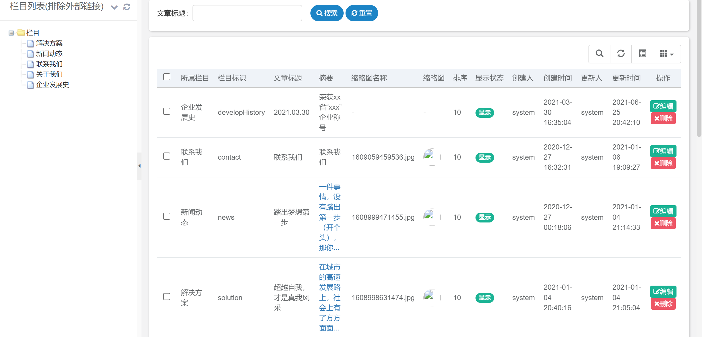
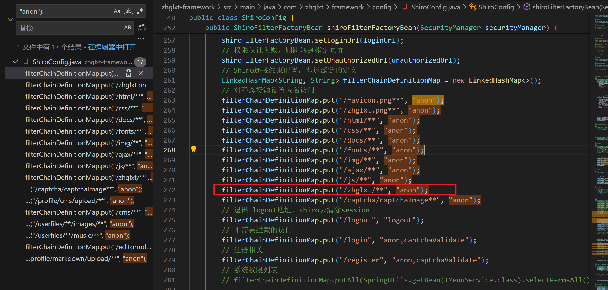

There is an unauthorized access vulnerability
http://127.0.0.1:8888/zhglxt/cms/article

可未授权查看登陆后能看到的文章，并执行增删改查等操作

shiro在控制权限时放行所有/zhglxt/下的路径，并认为其为静态资源

\zhglxt-framework\src\main\java\com\zhglxt\framework\config\ShiroConfig.java

